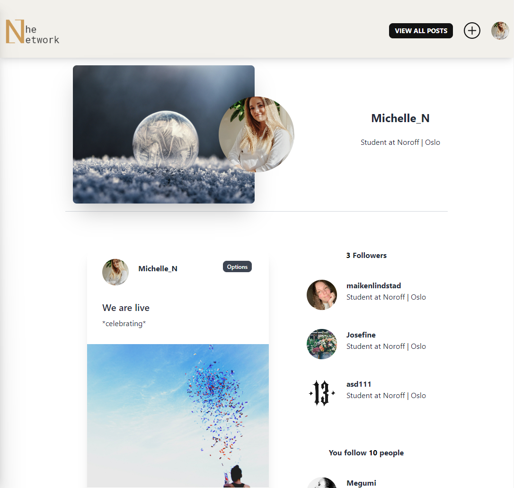

# The Network (Project exam)



The Network is a social media platform where people in tech can connect and share from their day to day life, projects and work. 

Check out [The Network](https://thenetworkapp.netlify.app) 

### Grade: A

## Given brief for the project exam

An existing Social Media company has approached you to create a brand new front end for their application. While they have a list of required features, the design and user experience has not been specified. Working with the official API documentation, plan, design and build a modern front end social media application.

### The Network is built with

- [React.js](https://reactjs.org/)
- [Tailwind](https://tailwindcss.com/)
- [DaisyUI](https://daisyui.com/)

### API

The API for this project is provided by Noroff and can be found in the [Noroff API documentation](https://noroff-api-docs.netlify.app/) under Social EndPoints. 

### Storage

- [Firebase](https://firebase.google.com/)

### Planning and design tools

- [Trello](https://trello.com/)
- [Adobe XD](https://www.adobe.com/creativecloud.html)


## Get Started

To get started, follow the steps below

### Install 

1. Clone the repo:

```bash
git clone git@github.com:Noroff-FEU-Assignments/project-exam-2-devMichelle.git
```

2. Install the dependencies by running npm install in terminal: 

```
npm install
```

### Running

To run the website/app run the following commands in terminal:

```bash
npm run start
```

### Sign up

To get access to this platform you first need to registrer for an account.

- Create an account with an @noroff.no or @stud.noroff.no email account. 
  ( e.g janedoe@noroff.no )

If you already have an account you can skip this step and log in. 

#### Guidelines

- Registering for an account is free
- Any posts created must be as real as possible to maintain the quality of the API
- All posts and profiles must be user friendly


## Contact

[My LinkedIn page](https://www.linkedin.com/in/michelle-kristine-narverud-11052715b/)
